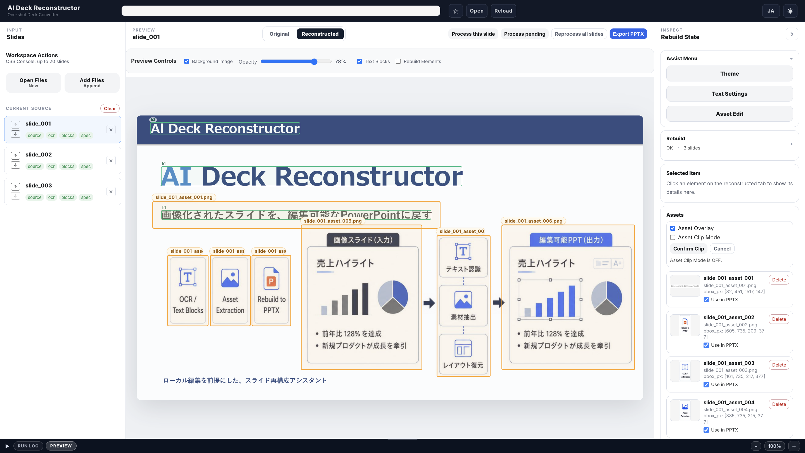

# AI Deck Reconstructor

*日本語は下にあります / Japanese follows below.*

A local browser workspace for reconstructing image-based slide decks into editable PowerPoint files.

AI Deck Reconstructor does not generate slides from scratch.
Instead, it takes slide images or PDF pages, runs OCR, extracts editable text blocks and visual assets, and rebuilds them as a PowerPoint deck that humans can refine.

**UI supports Japanese and English** (toggle in the top-right corner).

---



---

## Concept

Most AI slide generators can create impressive slide images, but fine-tuning those results is often difficult.

AI Deck Reconstructor focuses on the next step:

```text
slide images / PDF pages
→ OCR
→ text blocks
→ asset extraction
→ rebuild specification
→ editable PowerPoint deck
```

The goal is not one-shot generation.
The goal is reconstruction into a deck that can be edited, corrected, and reused.

---

## Features

### Slide Input
- Upload slide images
- Upload PDF files and convert pages into slide images
- Paste images from the clipboard
- Drag and drop files into the upload modal
- Reorder slides with up / down controls
- Delete individual source slides
- Clear current source files and generated artifacts

### OCR and Text Reconstruction
- Run OCR for each slide
- Convert OCR output into editable text blocks
- Review reconstructed text on top of the original slide image
- Apply text blocks to a rebuild specification
- Keep source slide IDs stable across deck reconstruction

### Asset Extraction
- Detect visual asset candidates from slide images
- Accept individual asset candidates
- Accept all detected candidates
- Manually clip image regions as assets
- Toggle whether each asset is used in the PowerPoint export
- Delete individual assets
- Keep asset IDs aligned with generated filenames

### Theme and Layout Editing
- Edit text style and placement
- Adjust theme colors
- Preview original and reconstructed slide states
- Use light / dark UI modes
- Switch UI language between Japanese and English

### PowerPoint Export
- Export reconstructed slides as editable `.pptx`
- Build output decks from the current rebuild specifications
- Preserve editable text and image assets where possible
- Use local files only; no cloud upload is required

---

## Requirements

**Tested on macOS. Linux should work with equivalent dependencies. Windows is not currently supported.**

| Requirement | Notes |
|---|---|
| OS | macOS / Linux |
| Python | Python 3.10+ recommended |
| NDLOCR-Lite | Install separately and configure the engine path |
| Flask / Pillow / python-pptx / pdf2image | Installed from `requirements.txt` |
| poppler | Required for PDF import. Mac: `brew install poppler` / Linux: `apt install poppler-utils` |

---

## Installation

### 1. Install NDLOCR-Lite

Install [NDLOCR-Lite](https://github.com/ndl-lab/ndlocr-lite) separately.

This project expects NDLOCR-Lite to be available from the local environment.
In the current default setup, the OCR engine path is configured in:

```text
json/ocr_engine_config.json
```

A common local layout is:

```text
parent-folder/
├── ai-deck-reconstructor/
└── ndlocr-lite/
```

### 2. Clone AI Deck Reconstructor

```bash
git clone https://github.com/StateToolsLab/AI-Deck-Reconstructor.git
cd AI-Deck-Reconstructor
```

### 3. Create a virtual environment

```bash
python3 -m venv .venv
source .venv/bin/activate
```

### 4. Install dependencies

```bash
pip install -r requirements.txt
```

If NDLOCR-Lite is installed as a local editable package, install it in the same environment.

```bash
pip install -e ../ndlocr-lite
```

---

## Usage

Start the local Flask app:

```bash
flask --app ui.app run --host 127.0.0.1 --port 5050
```

Then open:

```text
http://127.0.0.1:5050
```

Typical workflow:

1. Open or add slide images / PDF files
2. Run OCR or process a slide
3. Review text blocks and asset candidates
4. Accept or adjust extracted assets
5. Apply reconstruction rules
6. Export an editable PowerPoint deck

---

## Data Storage

AI Deck Reconstructor stores working files inside the project directory.

```text
AI-Deck-Reconstructor/
├── source/                  # Uploaded source slide images
├── assets/
│   └── slide_xxx/            # Extracted image assets
├── json/
│   ├── ocr/                  # OCR outputs
│   ├── slides/               # Rebuild specs and asset candidates
│   ├── text_blocks/          # Generated text blocks
│   ├── text_blocks_working/  # Editable working text blocks
│   └── themes/               # User theme configuration
├── output/                   # Generated files
└── docs/images/              # README images
```

Generated source files and assets can be cleared from the UI.
Repository files such as README images and configuration files are not removed by source clearing.

---

## Current Status

This project is in public-preparation / PoC stage.

It is intended for local experimentation with slide reconstruction workflows, especially when working with image-based AI-generated slides that need to become editable PowerPoint files.

---

## Changelog

### Public preparation branch
- Preserve source slide IDs in deck manifests
- Add slide ordering controls
- Stabilize asset ID and filename alignment
- Improve source clearing behavior
- Add PDF support to the main upload selector
- Add README workspace screenshot
- Remove extra bundled user themes
- Remove internal design notes

### Initial PoC
- Image slide normalization
- OCR pipeline
- Text block generation
- Rebuild specification generation
- Editable PowerPoint export

---

## Credits

This tool uses [NDLOCR-Lite](https://github.com/ndl-lab/ndlocr-lite), the OCR engine developed by the National Diet Library of Japan.

NDLOCR-Lite license: CC BY 4.0
https://creativecommons.org/licenses/by/4.0/

---

# AI Deck Reconstructor（日本語）

[NDLOCR-Lite](https://github.com/ndl-lab/ndlocr-lite) を使い、画像化されたスライドやPDFページを、編集可能なPowerPointデッキへ再構成するローカルブラウザツールです。

AI Deck Reconstructor は、スライドをゼロから生成するツールではありません。
画像として出力されたスライドを読み込み、OCR・テキストブロック化・素材抽出・再構成指定を通じて、人間が編集できるPowerPointへ戻すことを目的としています。

**UIは日本語・英語に対応しています（画面右上で切り替え）。**

---

## コンセプト

AIスライド生成ツールは、見栄えのよいスライド画像を作ることができます。
しかし、その後の細かな修正や再利用は難しい場合があります。

AI Deck Reconstructor が扱うのは、その次の工程です。

```text
スライド画像 / PDFページ
→ OCR
→ text_blocks
→ 素材抽出
→ rebuild_spec
→ 編集可能なPowerPointデッキ
```

目的は、一発生成ではありません。
目的は、編集・修正・再利用できるデッキへ再構成することです。

---

## 主な機能

### スライド入力
- スライド画像のアップロード
- PDFファイルのアップロードとページ単位の画像変換
- クリップボード画像の貼り付け
- アップロードモーダルへのドラッグ＆ドロップ
- 上下ボタンによるスライド順序変更
- 個別sourceスライドの削除
- 現在のsourceと生成物のクリア

### OCRとテキスト再構成
- スライド単位のOCR実行
- OCR結果から編集可能なテキストブロックを生成
- 元画像上で再構成テキストを確認
- text_blocks を rebuild_spec に反映
- source slide ID を維持したdeck manifest生成

### 素材抽出
- スライド画像から素材候補を検出
- 候補を個別に採用
- 候補を一括採用
- 画像領域を手動でクリップして素材化
- PowerPoint出力に使う素材を切り替え
- 個別素材の削除
- asset ID と生成ファイル名の整合性を維持

### テーマ・レイアウト編集
- テキストスタイルと配置の編集
- テーマカラーの調整
- Original / Reconstructed の状態確認
- ライト / ダークUI
- 日本語 / 英語UI切り替え

### PowerPoint出力
- 再構成されたスライドを編集可能な `.pptx` として出力
- rebuild_spec をもとにデッキを生成
- 可能な範囲でテキストと画像素材を編集可能な形で保持
- すべてローカルで処理し、クラウドへのアップロードは不要

---

## 動作環境

**macOSで確認しています。Linuxでも同等の依存関係があれば動作する想定です。Windowsは現時点では未対応です。**

| 必要なもの | 備考 |
|---|---|
| OS | macOS / Linux |
| Python | Python 3.10以上推奨 |
| NDLOCR-Lite | 別途インストールし、エンジンパスを設定 |
| Flask / Pillow / python-pptx / pdf2image | `requirements.txt` からインストール |
| poppler | PDF読み込みに必要。Mac: `brew install poppler` / Linux: `apt install poppler-utils` |

---

## インストール手順

### 1. NDLOCR-Liteをインストール

[NDLOCR-Lite](https://github.com/ndl-lab/ndlocr-lite) を別途インストールします。

このプロジェクトでは、ローカル環境からNDLOCR-Liteを呼び出せることを前提にしています。
現在のデフォルト構成では、OCRエンジンのパスは以下で管理します。

```text
json/ocr_engine_config.json
```

一般的なローカル配置例：

```text
parent-folder/
├── ai-deck-reconstructor/
└── ndlocr-lite/
```

### 2. AI Deck Reconstructorをクローン

```bash
git clone https://github.com/StateToolsLab/AI-Deck-Reconstructor.git
cd AI-Deck-Reconstructor
```

### 3. 仮想環境を作成

```bash
python3 -m venv .venv
source .venv/bin/activate
```

### 4. 依存ライブラリをインストール

```bash
pip install -r requirements.txt
```

NDLOCR-Liteをローカルのeditable packageとして使う場合は、同じ仮想環境にインストールします。

```bash
pip install -e ../ndlocr-lite
```

---

## 起動方法

ローカルFlaskアプリを起動します。

```bash
flask --app ui.app run --host 127.0.0.1 --port 5050
```

ブラウザで以下を開きます。

```text
http://127.0.0.1:5050
```

基本的な流れ：

1. スライド画像またはPDFを開く / 追加する
2. OCRまたはスライド処理を実行する
3. テキストブロックと素材候補を確認する
4. 素材候補を採用・調整する
5. 再構成ルールを反映する
6. 編集可能なPowerPointとして出力する

---

## データ保存場所

AI Deck Reconstructor は、作業ファイルをプロジェクトディレクトリ内に保存します。

```text
AI-Deck-Reconstructor/
├── source/                  # アップロードされた元スライド画像
├── assets/
│   └── slide_xxx/            # 抽出された画像素材
├── json/
│   ├── ocr/                  # OCR結果
│   ├── slides/               # rebuild_spec と asset候補
│   ├── text_blocks/          # 生成されたテキストブロック
│   ├── text_blocks_working/  # 編集用テキストブロック
│   └── themes/               # ユーザーテーマ設定
├── output/                   # 生成ファイル
└── docs/images/              # README用画像
```

UIからsourceと生成物をクリアできます。
README画像や設定ファイルなど、リポジトリ管理対象のファイルはsourceクリアでは削除されません。

---

## 現在の状態

このプロジェクトは、公開準備中 / PoC段階です。

画像化されたAI生成スライドを、編集可能なPowerPointへ戻すためのローカル再構成ワークフローを検証する目的で作られています。

---

## 更新履歴

### Public preparation branch
- deck manifestでsource slide IDを保持
- スライド順序変更UIを追加
- asset ID とファイル名の整合性を安定化
- source clear時の挙動を改善
- メインアップロード選択でPDFに対応
- README用ワークスペース画像を追加
- 余分なユーザーテーマを削除
- 内部設計メモを削除

### Initial PoC
- スライド画像の正規化
- OCRパイプライン
- テキストブロック生成
- rebuild_spec生成
- 編集可能なPowerPoint出力

---

## クレジット

OCRエンジンとして [NDLOCR-Lite](https://github.com/ndl-lab/ndlocr-lite)（国立国会図書館）を使用しています。

NDLOCR-Lite ライセンス：CC BY 4.0
https://creativecommons.org/licenses/by/4.0/
